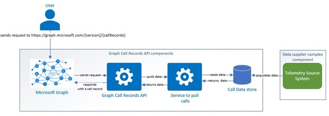

# Purpose Statement

This document explains to administrators the high-level architecture design of the Microsoft Graph Call Records API. The document serves as an informational overview to help administrators understand how Graph Call Records API service works internally, enabling them to better comprehend the root cause of bottlenecks and respond to the reported outages.

## Architecture Overview

The Graph Call Records API is designed to provide diagnostic call information to Microsoft Teams administrators. Image Figure 1 describes the high-level flow to fetch a call record.

Figure 1: Graph Call Records API High-Level Architecture

The architecture involves several key components and processes.

The architecture involves several key components and processes.

### Telemetry Source System

The Telemetry Source System is an Azure-based infrastructure that collects, processes, and organizes telemetry data from clients and services. It handles billions of daily events, enriching them with relevant metadata. This system builds call data from received telemetry and stores it in a high-throughput data store for quick retrieval. As a data supplier for the Microsoft Graph Call Records API, it enables administrators and developers to gain insights into communication patterns, troubleshoot issues, and optimize call performance within their organization.

### Graph Call Records API flow

The process of serving Graph Call Records API:

1. User Request:
Users make requests to the Graph Call Records API through tools like Postman or automated applications. The request is sent to
{Method} https://graph.microsoft.com/{version}/communications/callRecords?{query-parameters}
2. Microsoft Graph:
Microsoft Graph is a comprehensive platform that hosts various APIs. When a user makes a request to the Call Records API, Microsoft Graph redirects it to the dedicated Call Records API service.
3. Graph Call Records API Service:
This service processes the request and calls an inner service to pull the requested call data.
4. Service to pull data:
The inner service pulls the requested call data from the Azure-based Call Data Store. The Call Data Store contains data about the call, populated by the Telemetry Source System.
5. Response Construction:
The inner service sends the call data back to the Graph Call Records API service. The Graph Call Records API service formats the data into a call record and sends it back to Microsoft Graph. Microsoft Graph then responds to the user with the final call record.

## Graph Call Records API Outages: Causes and Solutions

During outages reported by the Graph Call Records API, customers frequently encounter numerous 500 Service Unavailable or 404 Not Found errors. The errors significantly affect the overall availability of the service. Common causes of these outages include:

1. Telemetry Source System Outages: The intricacy of the Telemetry Source System may lead to delays or errors, affecting the performance of the Graph Call Records API and resulting in delays in data delivery to the Call Data Store, which subsequently impacts data delivery to the customers.
2. Azure Outages: The Telemetry Source System components and the Call Records API pipeline components rely on Azure. Any issues with Azure can lead to significant delays or errors, affecting the timely delivery and accuracy of data.
3. Deployment Issues: Faulty deployments of any components involved to the Graph Call Records API flow can affect the service’s availability.

During the outages, customers experience significant data delays, though data loss is rare.

The recommendation to customers is to implement a retry mechanism for calling the Call Records API until the data is successfully delivered. However, excessive retries from multiple organization tenants during an outage can lead to even longer delays due to system overload. Therefore, while a retry mechanism is recommended, administrators should also refer to the provided workaround steps on the outage ticket, available in the “Health” tab of the Teams Admin Portal for further assistance.
